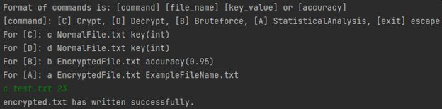
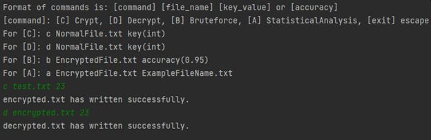

# Project1-Cryptanalyzer
Данный проект создан в рамках курса JavaRushUniversity и реализует
на примере алгоритма шифрования Цезаря процедуры:
1. Шифрование текстового файла с заданным ключом
2. Дешифрация текстового файла с заданным ключом
3. Дешифрация текстового файла с использованием Brute Force
4. Дешифрация текстового файла с использованием статистического анализа.

Основная реализация *пункта 1.* находится в классе **Encode** в методе 
>public List<String> encodeTxtFile(Path normalFile, int key)

Где происходит создание криптословаря с помощью **CryptoMapGenerator**, с помощью
которого и происходит кодирование текста. Чтение и запись файлов реализована
в классах **TxtFileReader** и **TxtFileWriter** соответственно.

*Результат выполнения команды **c test.txt 23***

В файл encrypted.txt будет записан текст вида:

---
Реализация *пункта 2.* находится в классе **Decode** и по факту является выполнением
пункта 1. с инвертированием ключа.

*Результат выполнения команды **d encrypted.txt 23***

В файл decrypted.txt будет записан текст вида:

---
Реализация *пункта 3.* находится в классе **BruteForce** в методе
>public int decodeByBruteForce(Path fileName, double accuracy)

и является перебором всех возможных ключей для заданного алфавита с последующим 
анализом по критериям *(наличия разделения слов пробелами, и корректного начала слов)* на предмет успешности полученного результата. При наличии
нескольких положительных результатов будет создано несколько файлов для ручного выбора
результата пользователем. При использовании BruteForce пользователь задает в качестве
параметра и точность, которая используется для вычисления соотношения корректных
коротких слов *(Constants.SHORT_WORD_DICTIONARY)* к общему их числу.

*Результат выполнения команды **b encrypted.txt 0.95***

В файл decryptedFile.txt будет записан текст вида:

---
Реализация *пункта 4.* находится в классе **StatisticalAnalysis**, который производит
создание двух словарей со статистикой *(класс CharacterFrequencyMapGenerator)* 
повторения каждого члена исходного алфавита в файлах с *зашифрованным текстом*
и файле для *сбора статистики*.
В результате сравнения словарей методом
> public HashMap<Character, Character> confirmMaps(HashMap<Character, Double> encryptedMap, HashMap<Character, Double> exampleMap)

формируется словарь соответствия символов, который и используется для дешифрации
криптотекста.

*Результат выполнения команды **a encrypted.txt ex.txt***

В файл decrypted.txt будет записан текст вида:

---
>К проекту прилагаются текстовые файлы которые использовались для тестирования:
+ test.txt - Роман М.Булгакова "Мастер И Маргарита"
+ ex.txt - Файл пример для статистического анализа

>Java архив Project1-Cryptoanalyser.jar собранный для версии Java:
